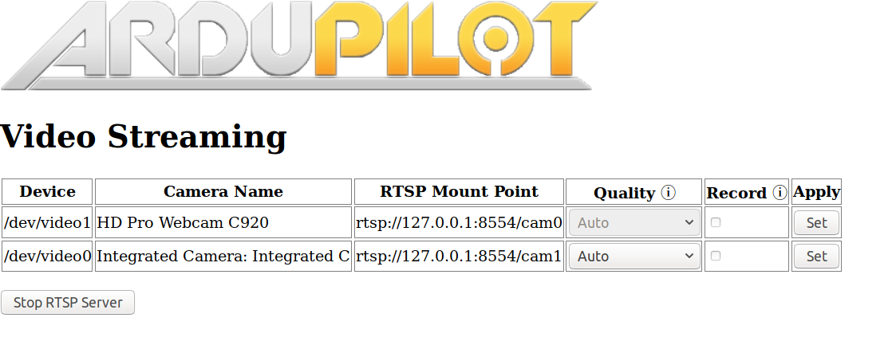

# Adaptive H.264 Streaming From ArduPilot Robots Using GStreamer

## Introduction

Using video cameras for live-streaming the video feed from aerial robots and other unmanned vehicles is becoming increasingly useful. Most video streaming solutions use RTP for streaming video over UDP. UDP is more efficient than TCP because it forgoes the overhead that comes with TCP's reliable delivery and congestion control mechanisms.

However, this introduces new problems when streaming video from robots. In most cases, we use the Companion Computer (CC) in Wi-Fi hotspot mode for streaming the video. Due to limited Wi-Fi range, the video Quality-of-Service progressively gets worse when the robot moves further away from the receiving computer.

The Adaptive Streaming aims to fix this problem by dynamically adjusting the video quality. Even over UDP, we can still obtain estimates of QoS using RTCP and parsing the RTCP Receiver Report packets on the CC. These RTCP packets provide helpful QoS information (such as RTT and packet loss) which can be used for automatically changing the bitrate and resolution of the video delivered from the CC.

Currently this project supports H.264 hardware encoding the video feed of the Raspberry Pi Camera on the Raspberry Pi 3B(+). H.264 software encoding is supported for all other V4L2 cameras.

### Note for hardware encoding webcams

Some webcams such as the Logitech C920 support hardware encoding through an onboard processor, however bugs in the UVC driver has resulted in some reduced functionality. These webcams are configured to adaptively stream only in 480p through adjusting the H.264 video bitrate. Switching the resolution results in the video client closing due to the transmission of an EOS event once the resolution has changed.

## Running the Code

Install the `gstreamer` dependencies:

```
sudo apt install libgstreamer-plugins-base1.0* libgstreamer1.0-dev libgstrtspserver-1.0-dev gstreamer1.0-plugins-bad gstreamer1.0-plugins-ugly python3-pip
```

Install `meson` from `pip` and `ninja` for building the code:

```
sudo pip3 install meson
sudo apt install ninja-build
```

Navigate to the `adaptive-streaming` folder and run:

```
meson build
cd build
sudo ninja install
adaptive_streaming
```

By default, port 5000 is used for sending RTP packets and port 5001 is used for sending and receiving RTCP packets.

On the Raspberry Pi, use `sudo modprobe bcm2835-v4l2` to load the V4L2 driver for the Raspberry Pi camera. Add `bcm2835-v4l2` to `/etc/modules` for automatically loading this module on boot.

## Usage

Video livestreams can be launched through both RTSP and UDP. It is recommended to use RTSP for streaming video as it provides the advantages of supporting multiple cameras, conifguring the resolution on-the-fly, and recording the livestream to a file.

### RTSP Streaming

#### APWeb (Recommended)

Start the [APWeb server](https://github.com/shortstheory/APWeb). This will serve the configuration page for the RTSP stream server.

On navigating to the new `video/` page, you will be presented with a page to start the RTSP Server:


On selecting the desired interface and starting the RTSP Server, the APWeb server will spawn the Stream Server process. The stream server will search for all the V4L2 cameras available in `/dev/`. It will query the capabilities of all these cameras and select hardware encoding or software encoding accordingly. The list of available cameras can be refreshed by simply stopping and starting the server.

From here, the APWeb page will display the list of available RTSP streams and their mount points:



The video quality can either be automatically set based on the avaialble network bandwidth or set manually for more fine-grained control.

The APWeb page also presents an option to record the video stream to a file. For this the video stream must be opened on the client. This works with any of the manually set resolutions but does **not** work with Auto quality. This is because the dynamically changing resolution causes problems with the file recording pipeline. An exception to this is the UVC cameras which can record to a file in Auto mode as well.

The RTSP streams can be viewed using any RTSP player.

For example, this can be done in VLC by going to "Media > Open Network Stream" and pasting in the RTSP Mount Point for the camera displayed in the APWeb configuration page. However, VLC introduces *two* seconds of latency for the jitter reduction, making it unsuitable for critical applications. To circumvent this, RTSP streams can also be viewed at zero latency by using the `gst-launch` command:

`gst-launch-1.0 playbin uri=<RTSP-MOUNT-POINT> latency=100`

As an example RTSP Mount Point looks like: `rtsp://192.168.0.17:8554/cam0`. Refer to the APWeb page to see the mount points given for your camera.

#### Standalone

Launch the RTSP stream server by running:

`stream_server <interface>`

The list of available network interfaces can be found by running `ifconfig`.

### UDP Streaming (Currently Broken!)

*Use this if you only need to stream from one camera at a time or your GCS doesn't support RTSP streaming*

On installing `adaptive-streaming`, run it from the terminal as so:

Software encoding - `adaptive_streaming /dev/video0 <RECEIVER_IP> raw`

Hardware encoding (recommended for the Raspberry Pi) - `adaptive_streaming /dev/video0 <RECEIVER_IP> h264`

For receiving the video stream, use the following `gst-launch` pipeline on the receiver:

`gst-launch-1.0 -v rtpbin latency=0 name=rtpbin udpsrc caps="application/x-rtp,media=(string)video,clock-rate=(int)90000,encoding-name=(string)H264,payload=96" port=5000 !  rtpbin.recv_rtp_sink_0 rtpbin. ! rtph264depay ! h264parse ! avdec_h264 ! autovideosink udpsrc port=5001 ! rtpbin.recv_rtcp_sink_0 rtpbin.send_rtcp_src_0 ! udpsink port=5001 sync=false async=false host=<SENDER_IP>`

For APSync images with the CC on 10.0.1.128, you can directly run `./recv_apsync_video`.

Typically, this `gst-launch` command should be run on the receiver before streaming the video from the companion computer.

#### Troubleshooting

Sometimes you might see:

```
** (adaptive_streaming:1358): CRITICAL **: gst_rtcp_packet_get_rb: assertion 'nth < packet->count' failed
```

printed on STDOUT when running `adaptive-streaming`. In this case, please check the `<SENDER_IP>` and  `<RECEIVER_IP>` in the above commands.